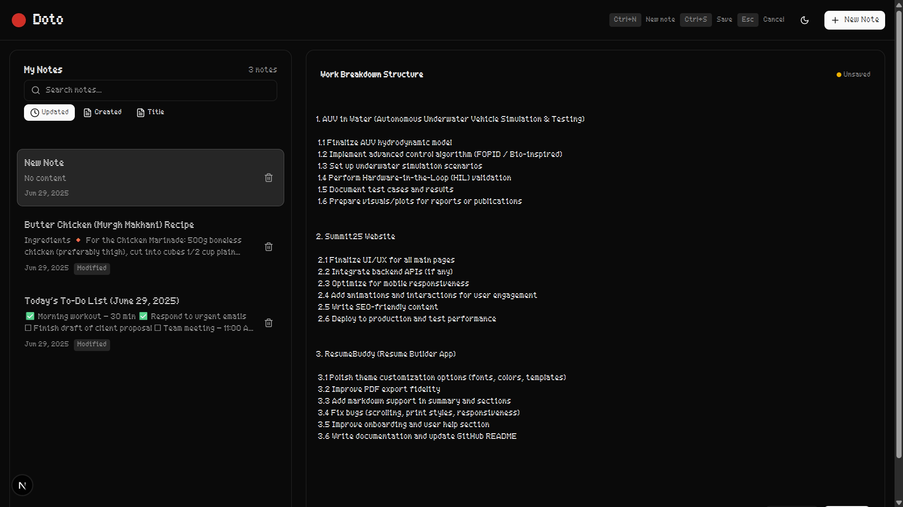

# 📝 Doto - Modern Note-Taking App

A beautiful, fast, and intuitive note-taking web application built with Next.js 15, React 19, and TypeScript. Doto provides a seamless writing experience with modern UI design and powerful features.

## ✨ Features

### 🎨 **Modern Design**
- **Dark/Light Theme Toggle** - Switch between themes or follow system preference
- **Responsive Layout** - Works perfectly on desktop, tablet, and mobile devices
- **Smooth Animations** - Beautiful click effects and transitions
- **Clean Interface** - Minimalist design focused on content

### 📝 **Note Management**
- **Create & Edit Notes** - Rich text editing with auto-save functionality
- **Organize Notes** - Sidebar navigation with note previews
- **Delete Notes** - One-click note deletion with confirmation
- **Persistent Storage** - Notes saved automatically to browser localStorage

### ⌨️ **Keyboard Shortcuts**
- `Ctrl/Cmd + N` - Create new note
- `Ctrl/Cmd + S` - Save note (when editing)
- `Escape` - Cancel editing mode
- `Ctrl/Cmd + K` - Focus search (coming soon)

### 🚀 **Performance & UX**
- **Auto-save** - Your work is saved automatically as you type
- **Instant Loading** - Fast page loads with Next.js optimization
- **Offline Support** - Works without internet connection
- **Click Effects** - Satisfying spark animations on interactions

## 🖼️ Screenshots

### Welcome Screen (Empty State)
When you first open Doto, you'll see a clean welcome screen encouraging you to create your first note.


### Light Theme
Clean, bright interface perfect for daytime use.


### Dark Theme
Easy on the eyes for late-night writing sessions.



## 🛠️ Tech Stack

- **Framework**: [Next.js 15](https://nextjs.org/) with App Router
- **Language**: [TypeScript](https://www.typescriptlang.org/)
- **UI Library**: [React 19](https://react.dev/)
- **Styling**: [Tailwind CSS](https://tailwindcss.com/) with custom animations
- **Icons**: [Lucide React](https://lucide.dev/)
- **Components**: Custom UI components with Radix UI primitives
- **Storage**: Browser localStorage for data persistence

## 🚀 Getting Started

### Prerequisites
- Node.js 18+ 
- npm, yarn, pnpm, or bun

### Installation

1. **Clone the repository**
   ```bash
   git clone https://github.com/yourusername/doto.git
   cd doto
   ```

2. **Install dependencies**
   ```bash
   npm install
   # or
   yarn install
   # or
   pnpm install
   # or
   bun install
   ```

3. **Run the development server**
   ```bash
   npm run dev
   # or
   yarn dev
   # or
   pnpm dev
   # or
   bun dev
   ```

4. **Open your browser**
   Navigate to [http://localhost:3000](http://localhost:3000) to see Doto in action!

## 📁 Project Structure

```
doto/
├── app/                    # Next.js app directory
│   ├── globals.css        # Global styles
│   ├── layout.tsx         # Root layout
│   └── page.tsx           # Main page component
├── components/            # React components
│   ├── ui/               # Reusable UI components
│   ├── click-spark.tsx   # Click animation effects
│   ├── empty-state.tsx   # Welcome/empty states
│   ├── header.tsx        # App header
│   ├── note-editor.tsx   # Note editing interface
│   ├── note-view.tsx     # Note viewing interface
│   ├── notes-sidebar.tsx # Notes navigation
│   ├── theme-provider.tsx # Theme context
│   └── theme-toggle.tsx  # Theme switcher
├── lib/                  # Utility functions
│   ├── storage.ts        # localStorage operations
│   ├── types.ts          # TypeScript definitions
│   └── utils.ts          # Helper functions
└── public/               # Static assets
    ├── fonts/            # Custom fonts
    └── *.png             # Screenshots and images
```

## 🎯 Key Features Explained

### Auto-Save System
Doto automatically saves your notes as you type, with a 500ms debounce to prevent excessive saves. You'll see a subtle "Saving..." indicator in the header when changes are being saved.

### Theme System
The app supports three theme modes:
- **Light**: Clean white interface
- **Dark**: Easy-on-the-eyes dark mode
- **System**: Automatically follows your OS theme preference

### Responsive Design
The layout adapts beautifully across devices:
- **Desktop**: Three-column layout with sidebar, editor, and preview
- **Tablet**: Collapsible sidebar with touch-friendly controls
- **Mobile**: Full-width interface optimized for touch

## 🔧 Available Scripts

- `npm run dev` - Start development server
- `npm run build` - Build for production
- `npm run start` - Start production server
- `npm run lint` - Run ESLint

## 🤝 Contributing

Contributions are welcome! Please feel free to submit a Pull Request. For major changes, please open an issue first to discuss what you would like to change.

### Development Guidelines
1. Fork the repository
2. Create a feature branch (`git checkout -b feature/amazing-feature`)
3. Commit your changes (`git commit -m 'Add amazing feature'`)
4. Push to the branch (`git push origin feature/amazing-feature`)
5. Open a Pull Request

## 📄 License

This project is licensed under the MIT License - see the [LICENSE](LICENSE) file for details.

## 🙏 Acknowledgments

- Built with [Next.js](https://nextjs.org/) and [React](https://react.dev/)
- Icons from [Lucide](https://lucide.dev/)
- UI components inspired by modern design systems
- Special thanks to the open-source community

## 📞 Support

If you have any questions or need help, please:
- Open an issue on GitHub
- Check the existing issues for solutions
- Reach out to the maintainers

---

**Made with ❤️ for the note-taking community**
